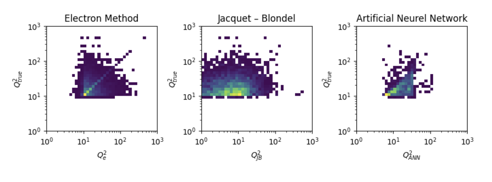

# EIC_JLAB_analysis

The purpose of this project is to analyze data from the EIC simulations and replicate the $x$, $y$ and $Q^2$ variables using an artifcial neural network (ANN) and compares its accuracy to using traditional methods. This project uses python and jupyter notebook for the creation of the ANN and graphing of the results.

## Results Summary

The Jacquet-Blondel method is clearly the least accurate. While Electron method is inaccurate for low $Q^2$ values, but is extremely accurate for high $Q^2$. 
The ANN however remained more consistently accurate. While it struggles to recognize some high $Q^2$ values, its calculations still remain relatively close to the original values when compared to the other methods. 

For a more detailed explanation of results and methodology, view the full [research paper](https://docs.google.com/document/d/1mMjOpO4WypGQkY7-agmGi1gizZdG5QbtoAL1DuFLuio/edit?usp=sharing).

